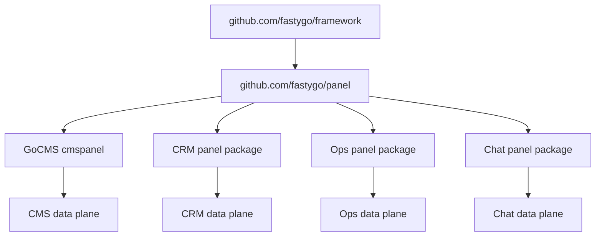

# Full Panel Repository Plan

## Goal

Create a standalone `github.com/fastygo/panel` repository at `[E:\_@Go\@Panel](E:\_@Go\@Panel)` that provides a reusable admin/application control plane. It must stay independent from GoCMS data-plane packages while supporting CMS, CRM, operations, GUI, chat, and future BaaS-style applications.

The package should consume lightweight primitives from `[E:\_@Go\@Framework](E:\_@Go\@Framework)` where useful, but it must not import `[E:\_@Go\@GoCMS\internal](E:\_@Go\@GoCMS\internal)` or any CMS domain package.

## Architecture Boundary



`panel` owns control-plane contracts: panels, resources, pages, widgets, actions, forms, tables, navigation, assets, policies, routing descriptors, editor providers, and optional data-source interfaces.

Application modules own data-plane behavior: content services, leads, deals, conversations, metrics, incidents, storage, APIs, and business workflows.

## Repository Foundation

1. Finalize `[E:\_@Go\@Panel\go.mod](E:\_@Go\@Panel\go.mod)`:
   - Keep `module github.com/fastygo/panel`.
   - Keep Go version aligned with Framework and GoCMS: `go 1.25.0`.
   - Add `github.com/fastygo/framework` only if `panel` intentionally exposes framework-compatible routing/navigation helpers.
   - Avoid UI and CMS dependencies in the first core layer.

2. Add standard repository files:
   - `[E:\_@Go\@Panel\README.md](E:\_@Go\@Panel\README.md)`.
   - `[E:\_@Go\@Panel\LICENSE](E:\_@Go\@Panel\LICENSE)` with MIT license.
   - `[E:\_@Go\@Panel\CHANGELOG.md](E:\_@Go\@Panel\CHANGELOG.md)`.
   - `[E:\_@Go\@Panel\CONTRIBUTING.md](E:\_@Go\@Panel\CONTRIBUTING.md)`.
   - `[E:\_@Go\@Panel\docs](E:\_@Go\@Panel\docs)` for design and usage documentation.
   - `[E:\_@Go\@Panel\examples](E:\_@Go\@Panel\examples)` for small runnable examples.

3. Add repository guardrails:
   - No imports from `github.com/fastygo/cms`.
   - Public package names must be stable and generic.
   - All comments and documentation in English.
   - Core contracts should prefer data descriptors and interfaces over CMS-specific handlers.

## Package Layout

Recommended initial layout:

- `[E:\_@Go\@Panel\panel.go](E:\_@Go\@Panel\panel.go)`
  Defines `Panel`, `PanelID`, `PanelOptions`, mount path, title, navigation, resources, pages, widgets, assets, policy, and lifecycle hooks.

- `[E:\_@Go\@Panel\registry.go](E:\_@Go\@Panel\registry.go)`
  Moves and evolves the current GoCMS `internal/platform/panel` registry: `Surface`, `Route`, `MenuItem`, `Asset`, `EditorProvider`, route/menu/asset filtering.

- `[E:\_@Go\@Panel\resource.go](E:\_@Go\@Panel\resource.go)`
  Defines `Resource`, `ResourceID`, `ResourceOperation`, resource route roles, CRUD capabilities, table/form/detail/action contracts.

- `[E:\_@Go\@Panel\page.go](E:\_@Go\@Panel\page.go)`
  Defines arbitrary `Page` screens: settings, reports, dashboards, setup wizards, runtime status pages.

- `[E:\_@Go\@Panel\widget.go](E:\_@Go\@Panel\widget.go)`
  Defines dashboard/page widgets: stat cards, chart descriptors, table widgets, activity feeds, health/status widgets.

- `[E:\_@Go\@Panel\action.go](E:\_@Go\@Panel\action.go)`
  Defines UI actions: header, row, bulk, modal, confirmation, URL redirect, server callback descriptor, action-local form schema.

- `[E:\_@Go\@Panel\schema.go](E:\_@Go\@Panel\schema.go)`
  Defines shared schema primitives for forms, detail views, filters, repeaters, relationship selectors, groups, sections, tabs, validation metadata.

- `[E:\_@Go\@Panel\table.go](E:\_@Go\@Panel\table.go)`
  Defines table schema: columns, sorting, search, filters, grouping, pagination, row actions, bulk actions, export descriptors.

- `[E:\_@Go\@Panel\policy.go](E:\_@Go\@Panel\policy.go)`
  Defines capability/policy interfaces without assuming CMS roles.

- `[E:\_@Go\@Panel\datasource.go](E:\_@Go\@Panel\datasource.go)`
  Defines optional Frappe-like data-source interfaces for records, query, commands, transactions, validation, and audit events. Keep implementations outside core.

- `[E:\_@Go\@Panel\editor.go](E:\_@Go\@Panel\editor.go)`
  Defines editor provider registration for rich text, JSON, markdown, code, and future plugin-provided editors.

## Core API Scope

### Phase 1: Control-Plane Kernel

Implement the minimal standalone kernel:

- `Panel` with ID, title, base path, navigation groups, assets, routes, resources, pages, widgets, policy.
- `Registry` for menu, routes, assets, editor providers.
- Generic `Principal` and `Capability` constraints similar to the current GoCMS slice.
- `Route` descriptors that can be mounted by an application-specific delivery layer.
- `Asset` descriptors with panel/surface scoping.
- `NavigationGroup` and `MenuItem` descriptors with ordering and policy filtering.

This phase should be enough to replace `[E:\_@Go\@GoCMS\internal\platform\panel\registry.go](E:\_@Go\@GoCMS\internal\platform\panel\registry.go)` with `github.com/fastygo/panel`.

### Phase 2: Filament-like Resource/Page Contracts

Add stable contracts for custom admin applications:

- `Resource` for CRUD-oriented domains.
- `Page` for arbitrary screens.
- `Widget` for dashboard and page blocks.
- `Action` for header, row, bulk, modal, and form-local actions.
- `FormSchema` and `TableSchema` as serializable descriptors.
- `DetailSchema` for view/read-only records.
- `Relation` descriptors for nested lists and relationship managers.

The goal is to model CMS posts, CRM leads, chat conversations, and ops services with the same primitives.

### Phase 3: Frappe-like Platform Capabilities

Add optional platform-level contracts, without forcing low-code behavior into every app:

- `DocumentType` or `RecordType` metadata for model-plus-view descriptions.
- `DataSource` and `RecordProvider` interfaces for service-backed records first.
- `Workflow` descriptors for states, transitions, guards, and actions.
- `Timeline` / `Activity` descriptors for comments, audits, status changes, and chat-like events.
- `Report` descriptors for tabular reports, filters, aggregations, and export.
- `ImportExport` descriptors for CSV/JSON import/export.
- `Print` descriptors for document rendering and printable output.
- `Portal` / external form descriptors only as later optional packages, not initial core.

## Documentation Plan

Create documentation under `[E:\_@Go\@Panel\docs](E:\_@Go\@Panel\docs)`:

- `docs/architecture.md`
  Explains control plane vs data plane, package boundaries, and why GoCMS/CRM/ops/chat stay outside core.

- `docs/concepts.md`
  Defines Panel, Resource, Page, Widget, Action, Form, Table, Policy, DataSource, Workflow, and Plugin/Extension concepts.

- `docs/filament-comparison.md`
  Maps Filament concepts to `fastygo/panel`: panels, resources, pages, widgets, forms, tables, actions, navigation, policies, assets.

- `docs/frappe-comparison.md`
  Maps Frappe concepts to optional panel contracts: DocType/RecordType, forms, list views, reports, workflows, permissions, scripts, print, portal/web forms.

- `docs/cms-integration.md`
  Explains how GoCMS uses `panel` through `cmspanel` while keeping CMS data-plane services separate.

- `docs/crm-example.md`
  Describes a future `crmpanel.LeadsResource` and `DealsResource` using the same core.

- `docs/ops-example.md`
  Describes `opspanel.ServicesPage`, incidents, metrics widgets, and alert actions.

- `docs/chat-example.md`
  Describes `chatpanel.ConversationsPage`, moderation queues, timeline widgets, and assistant workflow actions.

- `docs/api-stability.md`
  Defines what is stable in v0.x and what is experimental.

## README Plan

`README.md` should include:

- Project summary: reusable Go control plane for admin panels and business applications.
- Status badge or status note: early design / v0.
- Installation:

```bash
go get github.com/fastygo/panel
```

- Minimal panel example.
- Minimal resource example.
- Control plane vs data plane explanation.
- Comparison with Filament and Frappe.
- Package map.
- Documentation links.
- License notice.

## LICENSE Plan

Add MIT license in `[E:\_@Go\@Panel\LICENSE](E:\_@Go\@Panel\LICENSE)`:

- Copyright holder should be confirmed before implementation.
- Suggested placeholder if acceptable: `Copyright (c) 2026 FastyGo`.

## Examples Plan

Add small examples that prove generic usage:

- `examples/basic-admin`
  One panel, one dashboard page, one simple resource descriptor.

- `examples/crm-mini`
  Leads resource, deals resource, pipeline widget, no CMS imports.

- `examples/ops-mini`
  Services page, incidents resource, metrics widget, alert action.

- `examples/cms-adapter`
  Small conceptual adapter showing how GoCMS `cmspanel` can consume `github.com/fastygo/panel`.

Examples should be small and compile quickly. Avoid full UI implementation in the first version.

## GoCMS Migration Plan

After `github.com/fastygo/panel` is created:

1. Update Go workspace configuration so `[E:\_@Go\@GoCMS](E:\_@Go\@GoCMS)` can resolve local `[E:\_@Go\@Panel](E:\_@Go\@Panel)`.
2. Replace `github.com/fastygo/cms/internal/platform/panel` imports with `github.com/fastygo/panel`.
3. Keep `[E:\_@Go\@GoCMS\internal\platform\cmspanel](E:\_@Go\@GoCMS\internal\platform\cmspanel)` as CMS-specific consumer code.
4. Keep `[E:\_@Go\@GoCMS\internal\platform\plugins](E:\_@Go\@GoCMS\internal\platform\plugins)` as CMS/plugin runtime until generic extension contracts are stable.
5. Delete the old internal panel package only after GoCMS tests pass.
6. Update `[E:\_@Go\@GoCMS\.project\progress.md](E:\_@Go\@GoCMS\.project\progress.md)` to record that panel core moved to a standalone module.

## Testing Plan

Add tests inside `[E:\_@Go\@Panel](E:\_@Go\@Panel)`:

- Registry filtering and sorting.
- Multiple panels with separate base paths, nav, assets, resources, pages, and widgets.
- Capability/policy filtering without CMS imports.
- Resource descriptor validation.
- Form schema validation.
- Table schema validation.
- Action descriptor validation.
- Data-source contract tests using fake in-memory providers.
- Import guard test or architecture test that fails if `github.com/fastygo/cms` is imported.

Run for Panel:

```bash
go test ./...
go vet ./...
```

Run for GoCMS after migration:

```bash
go test ./...
npm run verify
```

## Release Plan

1. Start as `v0.1.0` once the core API, README, docs, examples, and MIT license exist.
2. Keep resource/page/schema/data-source APIs marked experimental until GoCMS and one non-CMS PoC both consume them.
3. Tag `v0.2.0` after CRM or ops mini example validates that no CMS-specific assumptions leaked into core.
4. Only consider `v1.0.0` after Panel, Resource, Page, Action, Form, Table, Policy, and DataSource contracts stabilize.

## Acceptance Criteria

- `github.com/fastygo/panel` builds and tests as a standalone module.
- The repository has README, docs, examples, changelog, contributing guide, and MIT license.
- The core package does not import GoCMS.
- GoCMS can use `github.com/fastygo/panel` instead of its internal panel package.
- At least one non-CMS example demonstrates CRM, ops, or chat-oriented usage.
- Documentation clearly explains control plane vs data plane and Filament/Frappe inspiration without copying their framework-specific assumptions.